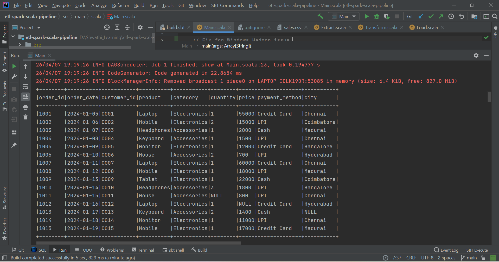
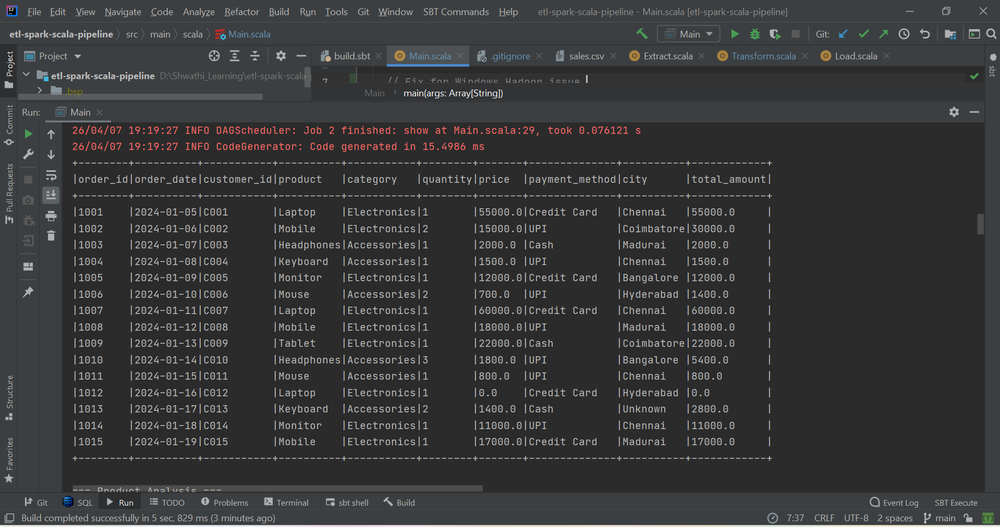
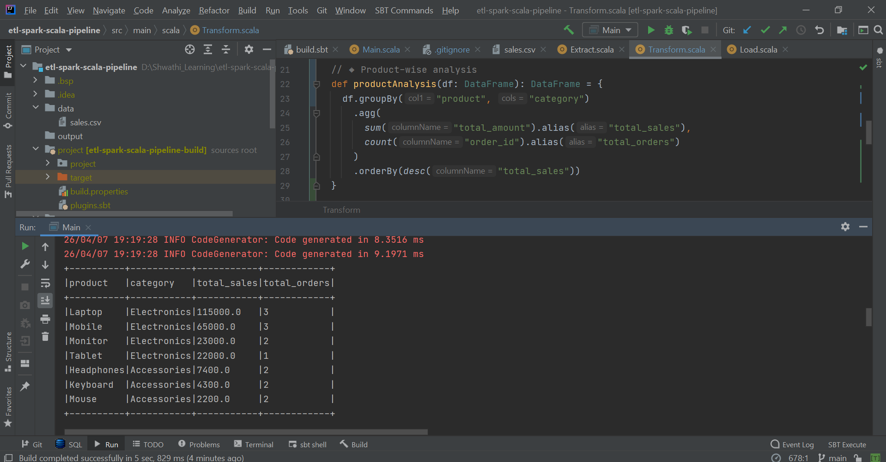
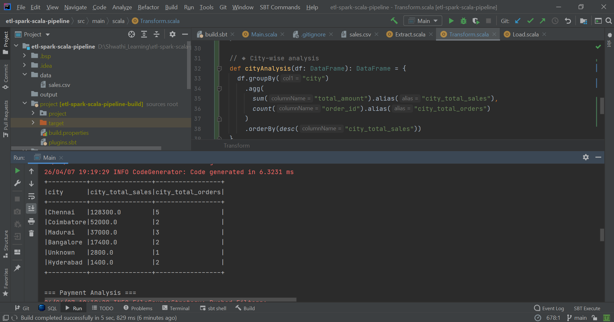
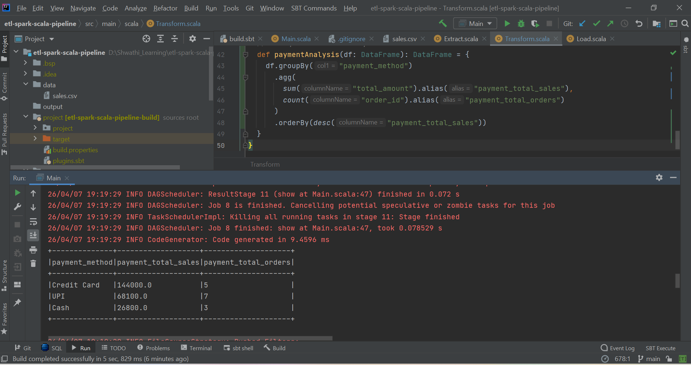

# ETL Pipeline using Scala and Apache Spark

## 📌 Overview
This project demonstrates the design and implementation of an ETL (Extract, Transform, Load) pipeline using Apache Spark with Scala.

The pipeline processes raw sales data, performs data cleaning and transformations, and generates meaningful business insights such as product performance, city-wise revenue, and payment method trends.

---

## 🏗️ Architecture
The pipeline follows a modular ETL design:

1. **Extract**
    - Reads raw data from CSV file

2. **Transform**
    - Handles missing values
    - Casts data types
    - Creates derived column (`total_amount`)
    - Performs aggregations

3. **Load**
    - Outputs processed data (console / file system)

---

## 🛠️ Tech Stack
- Scala
- Apache Spark
- SBT (Build Tool)

---

## 📂 Project Structure
etl-spark-scala-pipeline/
│── src/main/scala/com/project/
│   ├── Extract.scala
│   ├── Transform.scala
│   ├── Load.scala
│   ├── Main.scala
│── data/
│   ├── sales.csv
│── images/  
│   ├── rawData.png
│   ├── cleanedData.png
│   ├── productAnalysis.png
│   ├── cityAnalysis.png
│   ├── paymentAnalysis.png
│── build.sbt
│── README.md
│── .gitignore

---

## 📊 Dataset Description
The dataset contains sales transaction data with the following fields:

- order_id
- order_date
- customer_id
- product
- category
- quantity
- price
- payment_method
- city

### ⚠️ Data Challenges Included
- Missing values (quantity, price, city)
- Mixed categories and formats

---

## 🔄 Transformations Performed

- Filled missing values using default logic
- Converted data types (string → numeric)
- Created new column:
    - `total_amount = quantity × price`
- Aggregations:
    - Product-wise sales and order count
    - City-wise revenue analysis
    - Payment method analysis

---

## 📈 Business Insights

### 🔹 Product Analysis
- Identifies top-selling products based on total revenue
- Helps in inventory and sales strategy

### 🔹 City-wise Analysis
- Shows revenue distribution across cities
- Useful for regional business decisions

### 🔹 Payment Method Analysis
- Compares usage and revenue contribution of payment types
- Helps optimize payment strategies

---

## 🖥️ Output Preview

### 🔹 Raw Data

### 🔹 Cleaned Data

### 🔹 Product Analysis

### 🔹 City Analysis

### 🔹 Payment Analysis

---

## ⚠️ Note
Due to Windows-specific Hadoop native library limitations, file output (Parquet/CSV) may fail in local environments.

The pipeline is fully functional and can write output successfully in Linux-based environments.

---

## 🚀 How to Run

1. Clone the repository
2. Open in IntelliJ IDEA
3. Ensure Scala & SBT are installed
4. Run `Main.scala`

---

## 🔮 Future Improvements

- Integrate with Airflow for scheduling
- Store output in database (MySQL/PostgreSQL)
- Deploy on cloud platforms (AWS/GCP)
- Add real-time streaming using Spark Streaming

---

## 👩‍💻 Author
Shwathi
